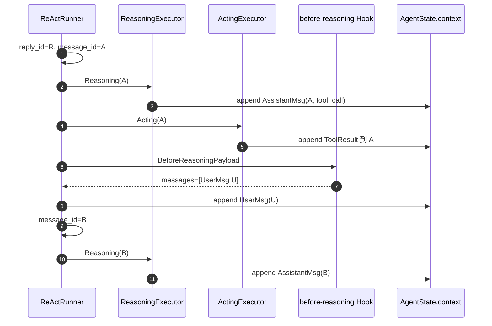

# PRD-C4 UserMessage 与 Assistant 消息边界

## 元信息

| 字段 | 值 |
|---|---|
| 阶段 | C4 |
| 名称 | Before-Reasoning UserMessage 与 Assistant `message_id` 边界 |
| 状态 | 已验收 |
| 创建日期 | 2026-08-24 |
| 定稿日期 | 2026-08-24 |
| 验收日期 | 2026-08-24 |
| 关联文档 | `docs/TODO.yaml` C4；`PRD-C2-agent-before-reasoning-hook.md`；`E:\ftre\docs\prd\PRD-F23-steering-message-boundary.md`；`AGENTS.md` |

## 1. 背景与目标

Core 当前把一次 `agent.run()` 产生的全部 Reasoning、Tool 和最终文本聚合到同一个
`reply_id`。`agent/before-reasoning` 注入 UserMessage 后，`MessageContext` 实际会创建
第二条 `AssistantMsg`，但两条消息仍使用同一个 id：

```text
AssistantMsg(id=reply-R)
UserMsg(id=user-U)
AssistantMsg(id=reply-R)   # id 重复
```

宿主只能继续按 `reply_id` 聚合事件，进而在 SessionProjection 和客户端额外推断
segment。该推断复制了 Core 已经具备的消息边界，也使 Tool、Session、重连和 UI
同时依赖一套隐含 id 约定。

本阶段目标是：保留 `reply_id` 作为整次 Reply Stream 标识，为每条实际
`AssistantMsg` 增加唯一 `message_id`；当 `BeforeReasoningResult.messages` 包含正式
`role=user` 消息时，Core 在下一次 Reasoning 前自然开启新的 AssistantMessage。

### 非目标

- 不改变 Steering“下一次 Reasoning 注入”的语义；
- 不取消正在运行的 LLM 或 Tool；
- 不让 Core import Inbox、Session、Cordis 或 ftre；
- 不增加 `start_new_assistant`、QueueItem、Port、Coordinator 或第二个 Hook；
- 不让临时 Plugin 上下文伪装成正式 UserMessage；非用户上下文使用 system/hint 语义。

## 2. 冻结语义

### 2.1 三个标识

| 标识 | 生命周期 | 责任 |
|---|---|---|
| `turn_id` | 宿主一次 Turn | 供 Hook、Trace、Session 状态关联 |
| `reply_id` | 一次 `agent.run()` | 关联 ReplyStart/ReplyEnd 和整次运行 |
| `message_id` | 一条 AssistantMsg | 路由 Thinking/Text/Tool/Token 事件和持久化消息 |

一次 Reply 可以包含多条 AssistantMessage：

```text
reply_id=R
├─ AssistantMsg(message_id=A)
├─ UserMsg(id=U)
└─ AssistantMsg(message_id=B)
```

### 2.2 UserMessage 默认建立边界

`BeforeReasoningResult` 保持现有结构，不增加布尔开关：

```python
@dataclass(frozen=True, slots=True)
class BeforeReasoningResult:
    messages: tuple[Mapping[str, Any], ...] = ()
```

Core 使用消息本身的角色判断：

```python
has_user_message = any(message.get("role") == "user" for message in result.messages)
```

- 首次 Reasoning 前还没有 AssistantMsg：追加消息，但不制造空的 Assistant 边界；
- 已经存在当前 AssistantMsg，且结果包含 UserMessage：先按顺序追加消息，再为下一次
  Reasoning 生成新的 `message_id`；
- 只包含 system/assistant 消息：不因宿主内部上下文自动切分 Assistant；
- 同一边界包含多条 UserMessage：按顺序追加，只生成一条新的 AssistantMessage。

### 2.3 安全边界

Hook 只会在真实 Reasoning 前运行。因此此前的 LLM、ToolCall 和 ToolResult 已经全部完成：

```text
Reasoning(message_id=A)
→ Acting(message_id=A)
→ ToolResult 完成
→ agent/before-reasoning
→ append UserMessage U
→ rotate message_id A → B
→ Reasoning(message_id=B)
```

不移动 ToolBlock，不修改已经完成的 A，也不打断 Tool 协议配对。

## 3. 功能需求

- [x] **FR1：RunState 拥有独立 message_id**
  - `RunState.reply_id` 在整个 run 中保持不变；
  - `RunState.message_id` 指向当前 AssistantMsg；
  - 新 run 初始化 `message_id`，UserMessage 边界只旋转 `message_id`。

- [x] **FR2：BeforeReasoningResult 保持最小契约**
  - Result 仍只有 `messages`；
  - 正式 `role=user` 自动建立下一条 Assistant 消息边界；
  - Core 保存 mapping 中的稳定 `id`、role、content 和 metadata；
  - 同一 message id 重放不重复追加。

- [x] **FR3：事件同时携带 reply_id 与 message_id**
  - ReplyStart、ReplyEnd、Model、Text、Thinking、Data、Tool、Retry、权限事件均能关联
    当前 `message_id`；
  - `reply_id` 继续表示整次 Reply Stream；
  - `Msg.append_event()` 按 `message_id` 校验目标，不再要求 `Msg.id == reply_id`。

- [x] **FR4：Reasoning/Acting 使用当前 message_id**
  - 一次 Reasoning 及其 ToolCall/ToolResult 全部写入同一个 AssistantMsg；
  - Tool 完成后的 UserMessage 进入 Context 后，下一次 Reasoning 写入新 AssistantMsg；
  - LLM retry 不旋转 message_id；stop-decision continuation 不因隐藏 Hint 自动切分。

- [x] **FR5：权限恢复和持久状态可重建**
  - ASK/ALLOW/DENY 恢复能从 ToolCallBlock 所在 Msg 恢复 `message_id`；
  - 进程重启后不会把 ToolResult 写进另一条 AssistantMsg；
  - Core Context 中所有 Msg.id 唯一。

- [x] **FR6：删除单 Reply 单 Msg 假设**
  - 删除“一个 run 只对应一个 Msg”的注释、测试和实现约束；
  - 不保留重复 id、compat alias 或双路事件聚合。

## 4. Core 数据流程



最终 Context：

```text
User(initial)
Assistant(A: tool_call + tool_result)
User(U: steering)
Assistant(B: next reasoning)
```

## 5. 代码位置与改动

| 文件 | 当前职责/问题 | C4 改动 |
|---|---|---|
| `src/ftre_agent_core/agent/runner/_state.py` | `RunState` 只有 `reply_id` | 增加并重置当前 `message_id` |
| `src/ftre_agent_core/agent/runner/react_runner.py` | Hook message 直接 add_raw，reply_id 不变 | 保留正式消息 id；检测 role=user；安全边界旋转 message_id |
| `src/ftre_agent_core/agent/runner/_execute_reasoning.py` | 所有 Block/Event 使用 reply_id | Memory 写入和 Event 路由改用当前 message_id，同时保留 reply_id |
| `src/ftre_agent_core/agent/runner/_execute_acting.py` | ToolResult 追加到 reply_id 对应 Msg | 使用产生 ToolCall 的 message_id，保证配对 |
| `src/ftre_agent_core/message_context.py` | 强制单 Reply 单 Msg；add_raw 丢失 id/metadata | Msg.id 唯一；保存结构化消息 id/metadata；删除单 Msg 假设 |
| `src/ftre_agent_core/message/_msg.py` | `append_event` 校验 reply_id == Msg.id | 改为校验 message_id |
| `src/ftre_agent_core/event/_event.py` | 流事件只有 reply_id | 为 Assistant 流事件补充 message_id |
| `src/ftre_agent_core/hooks.py` | Result 只有 messages | 契约保持不变；补充“role=user 建立边界”文档和校验 |
| `tests/test_react_runner_step_hook.py` | 只验证消息进入 LLM | 验证 A→U→B、唯一 id、多 User 单边界和首轮行为 |
| `tests/test_message_context.py` | 明确断言单 Reply 单 Msg | 改为按 message_id 验证多 AssistantMsg 与 Tool 配对 |
| `tests/test_permission_acting.py` | 权限恢复只关注 reply_id | 增加 message_id 恢复和 ToolResult Owner 测试 |

## 6. 验收标准

- [x] **AC1**：一次 Tool→Steer→Reasoning 的 Core Context 角色顺序为
  `assistant(A) → user(U) → assistant(B)`，且 A/U/B id 唯一。
- [x] **AC2**：A 的 ToolCall 与 ToolResult 保持配对，B 只接收下一次 Reasoning 的内容。
- [x] **AC3**：所有 Core Assistant 流事件同时携带稳定 reply_id 和正确 message_id。
- [x] **AC4**：首次 Reasoning、无 Hook、仅 system 注入、多个 UserMessage、LLM retry、
  cancellation、ContinueTurn、权限暂停/恢复均有回归测试。
- [x] **AC5**：Core 不包含 ftre/Inbox/Cordis import，不增加新 Hook 或队列状态。
- [x] **AC6**：`python -m pytest -q`、`python -m ruff check .`、wheel 与洁净安装通过。
- [x] **AC7**：配套 ftre F23 和 Desktop B4 使用 message_id 后跨仓协议测试通过。

## 7. 变更记录

| 日期 | 变更内容 | 理由 |
|---|---|---|
| 2026-08-24 | 创建 C4 草稿；冻结“BeforeReasoningResult 不新增字段、正式 UserMessage 自动建立 Assistant message_id 边界”的方案 | Core 已产生多条 AssistantMsg 但复用 reply_id，导致宿主重复实现 segment 推断 |
| 2026-08-24 | 完成 Core message_id、自动 UserMessage 边界、Tool/权限路由、全量测试与 wheel 洁净安装 | 三端统一使用 A→User→B 的自然消息结构 |
